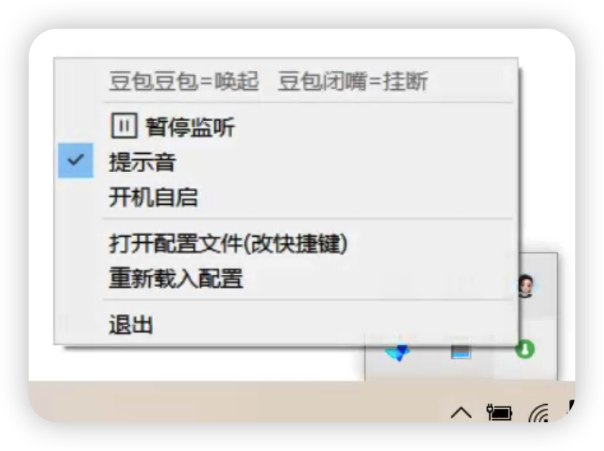

# doubao-wake · 豆包语音唤醒（Windows）

给 **豆包电脑版** 加上"语音唤醒词",像喊「小爱同学」一样喊一声就唤起豆包语音对话。

- 喊 **「豆包豆包」** → 唤起豆包语音（模拟按豆包的全局快捷键 `Alt+D`）
- 喊 **「豆包闭嘴」** → 挂断豆包语音（模拟 `Alt+Q`）

唤醒识别用 **讯飞离线语音唤醒（AIKit / ivw70）**,纯本地、不上传音频;唤起后通过模拟豆包的全局快捷键把语音叫出来。常驻系统托盘。

> 平台:**仅 Windows（64 位）**。录音用系统自带 winmm,无需 sounddevice/PortAudio。

## 截图

托盘菜单(右键托盘小图标):



## 功能特性

- 🎙️ 离线中文唤醒词,自定义(讯飞 ivw70)
- ⌨️ 唤起/挂断快捷键**可在 config.ini 里改**(豆包以后换快捷键不用动代码)
- 🔔 唤起后提示音(延迟到豆包语音界面起来再响,像"可以说话了")
- 🖥️ 系统托盘小图标:暂停/恢复、提示音开关、开机自启、打开配置、退出
- 🌙 防休眠:关显示器后仍持续监听(系统不自动睡)
- 🧩 单实例锁、后台 `run.log`、启动失败气泡通知
- 📦 录音零第三方依赖(winmm),仅需 `keyboard` + 托盘的 `pystray`/`Pillow`

## 它是怎么工作的

```
麦克风(winmm) → 讯飞 ivw70 离线唤醒 → 命中唤醒词
              → 模拟豆包全局快捷键(Alt+D / Alt+Q) → 唤起/挂断豆包语音
```

## 准备与安装

### 1. 安装 64 位 Python
[python.org](https://www.python.org/downloads/) 下载,安装时勾选 **Add Python to PATH**。
命令行 `python --version` 能显示版本即可。

### 2. 讯飞配置(关键)
本项目依赖讯飞**离线语音唤醒** SDK 与你自己的应用凭据(仓库**不含**这些专有文件/凭据,需自行获取,免费):

1. 注册 [讯飞开放平台](https://www.xfyun.cn)(个人手机号实名即可,**不需要企业邮箱**)。
2. 控制台**创建应用**,为它开通 **「语音唤醒(离线)」** 能力,并**领取免费的设备授权**(数量 > 0)。
3. 在「语音唤醒」的 SDK 下载页,**选定这个应用**,下载 **Windows 版 ivw 离线 SDK**(下载即和该应用绑定)。
4. 在「应用详情」页拿到 **AppID / APIKey / APISecret** 三个凭据。

> 首次运行需要联网做一次在线激活;之后离线可用。

### 3. 放置文件
本仓库提供的是**源码与脚本**。把讯飞 SDK 与本仓库合并成如下结构:

```
你的讯飞SDK根目录/
├─ libs/64/  AEE_lib.dll, ef7d69542_*.dll      ← 讯飞 SDK 自带
└─ bin/
   ├─ wake_doubao_xfei.py                        ← 本仓库 bin/
   ├─ 1-install.bat / 2-run.bat / 3-run-background.bat  ← 本仓库 bin/
   ├─ config.ini                                 ← 由 config.ini.example 复制并填写
   └─ resource/ivw70/
        ├─ IVW_GRAM_1 / IVW_FILLER_1 / IVW_MLP_1 / IVW_KEYWORD_1  ← 讯飞 SDK 自带
        └─ xbxb.txt                              ← 唤醒词(本仓库已带示例)
```

即:把本仓库 `bin/*` 拷进讯飞 SDK 的 `bin/` 目录,`libs/` 和 `resource/ivw70/IVW_*` 用 SDK 自带的。

### 4. 填凭据
把 `bin/config.ini.example` 复制为 `bin/config.ini`,填入第 2 步拿到的 `appid / apikey / apisecret`。

### 5. 装依赖并运行
```
双击 1-install.bat        (装 keyboard + pystray + Pillow,只需一次)
双击 2-run.bat            (前台带日志窗口,适合首次调试)
   或 3-run-background.bat (无窗口,只在托盘显示图标,适合日常)
```
启动后对着麦克风喊「豆包豆包」「豆包闭嘴」即可。

## 配置(config.ini)

| 项 | 说明 |
|---|---|
| `appid` / `apikey` / `apisecret` | 讯飞应用三件套(必填) |
| `wake_hotkey` | 唤起豆包语音的快捷键,如 `alt+d` / `ctrl+alt+v` / `ctrl+space` |
| `hangup_hotkey` | 挂断语音的快捷键,如 `alt+q` |
| `beep` | 提示音 `1` 开 / `0` 关 |
| `wake_beep_delay` | 唤起提示音延迟(秒),等豆包界面起来再响 |
| `cooldown` | 同一动作冷却(秒),防连发 |
| `mic_device` | 麦克风设备号,`-1`=系统默认(改这项需重启) |

改完保存后:**右键托盘图标 → 重新载入配置** 即可生效(改 `mic_device` 需重启)。

## 唤醒词(resource/ivw70/xbxb.txt)

UTF-8 保存,**每个词单独一行,且每行结尾都要带英文分号 `;`**:

```
豆包豆包;
豆包闭嘴;
```

- 含「闭嘴」的词 = 挂断(Alt+Q),其它词 = 唤起(Alt+D)
- ⚠️ 少了结尾的 `;` 会导致只有最后一个词能被识别(实测坑)
- 建议每个词 3~4 个不同音节;重复音(如"豆包豆包")相对更难识别,识别不灵可换词

## 常见问题

- **`AIKIT_Init 失败 18708` / "无可用的授权"**:讯飞侧授权配额问题。去控制台给该应用开通/领取「语音唤醒(离线)」免费设备授权,然后**重新下载 SDK**(绑定该应用)覆盖 `libs/`、`resource/`。`authType` 保持 `0`(设备级,免费)。
- **`AIKIT_EngineInit 失败 18201` / `openLibrary error`**:引擎子 DLL 没找到。确认用 **64 位 Python**、`libs/64` 与 `bin` 相对位置没动(脚本已把 `libs/64` 加入 PATH)。仍失败装一下 [VC++ 运行库 x64](https://aka.ms/vs/17/release/vc_redist.x64.exe)。
- **`AIKIT_Start 失败 100011`**:参数非法,通常是唤醒词格式问题,见上面 `;` 说明。
- **喊了没反应**:`2-run.bat` 看有没有打印「识别输出」;`SHOW_LEVEL=True` 可看麦克风电平;或在 `config.ini` 改 `mic_device`。
- **锁屏(Win+L)/手动睡眠时不工作**:模拟按键送不到豆包,属预期限制;关显示器(黑屏)是可以的。

## 免责声明

- 本仓库**不包含**讯飞 SDK 的专有二进制(`AEE_lib.dll`、`ef7d69542_*.dll`、`IVW_*` 等),请自行从讯飞开放平台下载,并遵守其授权协议。
- 「豆包」为字节跳动产品,本项目仅通过模拟其全局快捷键与之交互,与字节跳动、讯飞均无隶属关系。
- 仅供学习与个人使用。

## License

MIT
